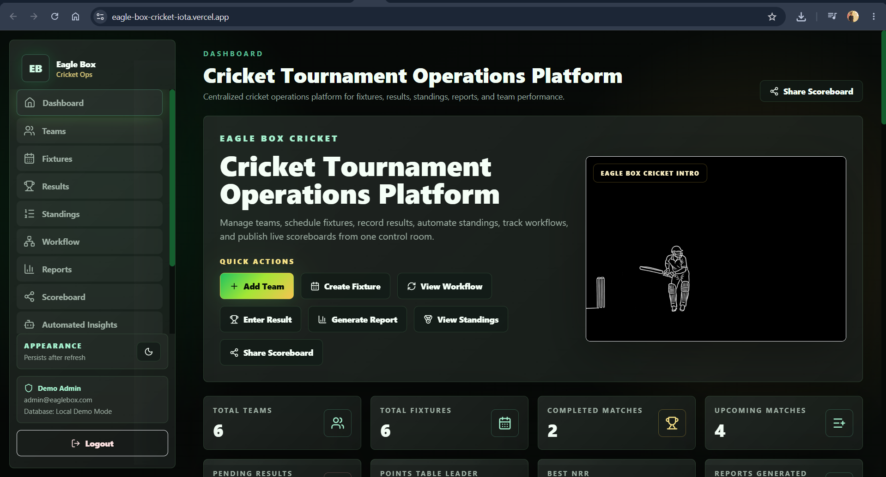
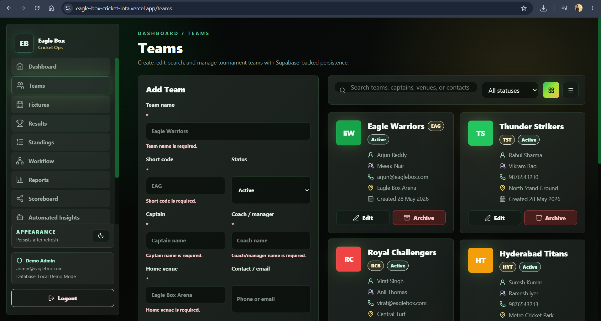
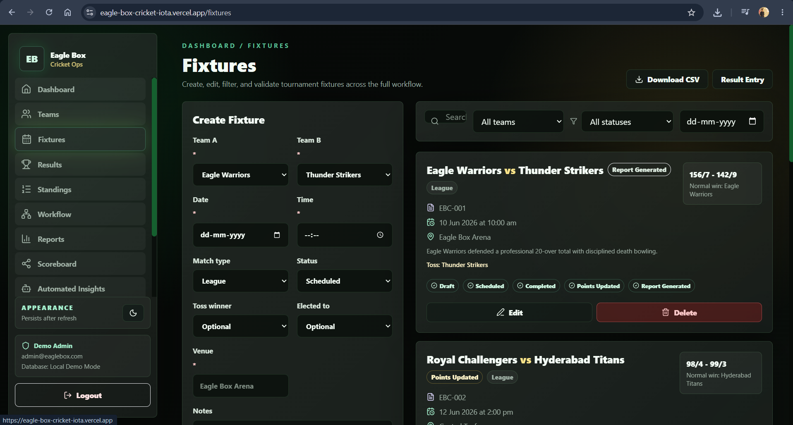
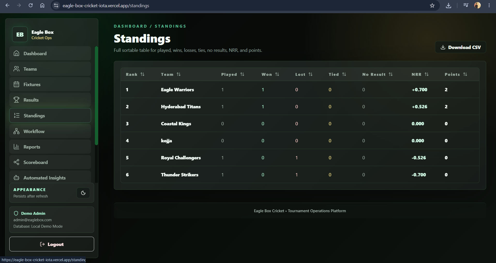
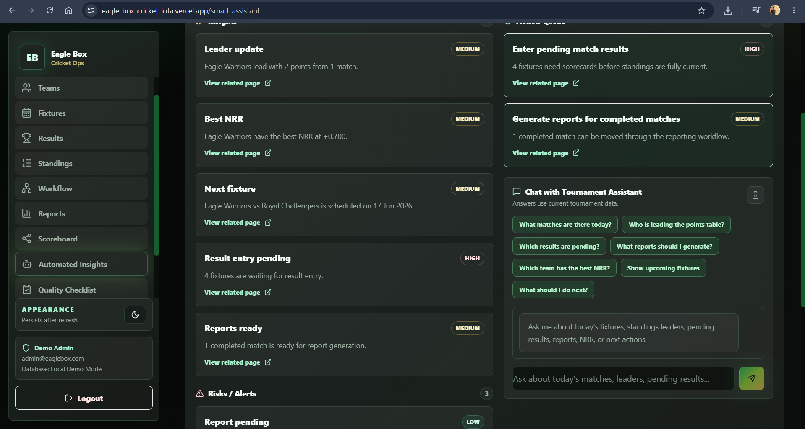
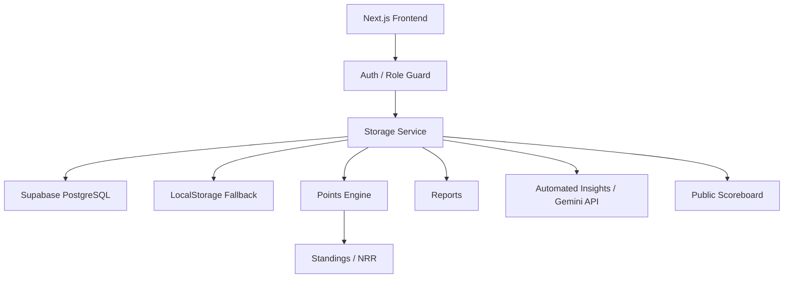

# Eagle Box Cricket - Tournament Operations Platform

A full-stack cricket tournament management platform for managing teams, fixtures, match results, standings, reports, public scoreboard, workflow tracking, and AI-powered tournament insights.

**Live demo:** [https://eagle-box-cricket-iota.vercel.app/](https://eagle-box-cricket-iota.vercel.app/)

## Demo Access

| Role | Email | Password | Access |
| --- | --- | --- | --- |
| Admin | `admin@eaglebox.com` | `admin123` | Create, edit, delete, and manage tournament data |
| Viewer | Any name or email | No password | Read-only public access |

## Feature Highlights

- Role-based Admin and Viewer access
- Team management with active, inactive, and archived states
- Fixture scheduling with workflow status tracking
- Toss and match result entry
- Cricket overs validation
- Points table and Net Run Rate calculation
- Dedicated standings page with sortable table
- Workflow tracking from draft to report generated
- Reports and CSV/print-friendly exports
- Public scoreboard page
- Automated Insights and Gemini-powered assistant
- Supabase PostgreSQL support
- LocalStorage fallback for local demo mode
- Protected `/admin/*` control room with Supabase Auth support
- Realtime live score updates from admin scoring to public viewer pages
- Dark/light mode with persistence
- Responsive dashboard
- Video hero animation

## Tech Stack

- Next.js App Router
- React
- TypeScript
- Tailwind CSS
- Supabase PostgreSQL
- Gemini API
- Vercel
- Recharts
- Framer Motion
- lucide-react
- Browser CSV export and print/PDF workflow

## Screenshots

Available screenshots:







TODO: Add the remaining screenshots manually when available:

- `./screenshots/results.png`
- `./screenshots/reports.png`
- `./screenshots/scoreboard.png`

## System Architecture



For deeper implementation notes, see [docs/ARCHITECTURE.md](./docs/ARCHITECTURE.md).

## Data Model

The main entities are:

- **Teams**: tournament teams, captains, coaches, venues, contact details, status, and branding color.
- **Fixtures**: scheduled matches, teams, venue, match type, workflow status, toss data, and result metadata.
- **Match Results**: runs, wickets, overs, result type, winner, player of the match, and notes.
- **Player Batting Stats**: per-fixture batting entries for player performance reporting.
- **Player Bowling Stats**: per-fixture bowling entries for wickets, overs, and runs conceded.
- **Tournament Settings**: format and configurable points rules.
- **Reports**: generated report logs and summaries.
- **Activity Logs**: operational timeline events.

Supabase schema is located at:

```text
supabase/schema.sql
```

## Project Structure

The working Next.js app remains at the repository root for Vercel compatibility:

```text
app/          Next.js App Router pages and API routes
components/   Shared UI and league components
hooks/        Client hooks
lib/          Storage, Supabase, scoring, and utility logic
public/       Static assets and videos used by the app
supabase/     Current Supabase schema SQL
backend/      Backend organization notes for Supabase SQL, migrations, seeds, and scripts
```

The frontend was not moved into `frontend/` because the existing Vercel setup expects the Next.js root files (`app/`, `package.json`, `next.config.ts`, `public/`) at the repository root.

## Cricket Logic

Tournament points are configurable from Settings:

- Win = configurable points
- Tie = configurable points
- Loss = configurable points

Net Run Rate is calculated as:

```text
(Runs Scored / Overs Faced) - (Runs Conceded / Overs Bowled)
```

Overs are stored and calculated internally as balls for accuracy. For example, `18.4` means 18 overs and 4 balls, not 18.4 decimal overs.

## Environment Variables

Create `.env.local` locally using this shape:

```env
NEXT_PUBLIC_SUPABASE_URL=
NEXT_PUBLIC_SUPABASE_ANON_KEY=
NEXT_PUBLIC_SUPABASE_PUBLISHABLE_KEY=
NEXT_PUBLIC_ADMIN_EMAILS=admin@eaglebox.com
NEXT_PUBLIC_ADMIN_PASSWORD=admin123
SUPABASE_SERVICE_ROLE_KEY=
GEMINI_API_KEY=
```

Security notes:

- Do not commit `.env.local`.
- `GEMINI_API_KEY` is server-side only and must never be exposed in client code.
- Supabase public/publishable keys are safe for browser use when Row Level Security is configured correctly.
- Admin access is authorized by the Supabase `admins` table, using `admins.user_id = auth.users.id`.
- `NEXT_PUBLIC_ADMIN_EMAILS` and `NEXT_PUBLIC_ADMIN_PASSWORD` are only for local demo fallback when Supabase is not configured.
- A Supabase service role key, if added in the future, must never be exposed to the browser.

## Local Setup

```bash
npm install
npm run dev
```

Open [http://localhost:3000](http://localhost:3000).

Production build check:

```bash
npm run build
```

Start a production build locally:

```bash
npm run start
```

## Supabase Setup

1. Create a Supabase project.
2. Copy the project URL and publishable key.
3. Add the environment variables to `.env.local`.
4. Open the Supabase SQL Editor.
5. Run `supabase/schema.sql`.
6. In Supabase Auth, create an email/password user for each admin email.
7. Copy that user's Auth UID and add it to `admins`:

```sql
insert into admins (user_id, email)
values ('AUTH_USER_ID_HERE', 'admin@eaglebox.com');
```

8. Ensure Realtime is enabled for `league_snapshots`, `live_matches`, `ball_events`, `fixtures`, and `results` (the schema attempts to add them to the Supabase realtime publication).
9. Redeploy on Vercel after adding environment variables.

If Supabase is not configured or becomes unavailable during local use, the app falls back to browser LocalStorage demo mode.

## Live Scoring Flow

1. Open `/admin/login` on Device 1 and sign in with a Supabase Auth admin user that exists in `admins`.
2. Go to `/admin/live-score`, select a match, batting team, striker, non-striker, and bowler.
3. Click **Start Match**, then use the ball outcome buttons.
4. Open `/live-score` or `/matches/[id]` on Device 2. The viewer page subscribes to Supabase Realtime (`live_matches`, `ball_events`, and `league_snapshots`) and updates without a full reload. A 5-second polling refresh remains as backup. The old `/live` route redirects to `/live-score`.

## Gemini Assistant

Automated Insights and the chat assistant call server-side API routes. The frontend sends current tournament data to the API route, and the server uses `GEMINI_API_KEY` when available. If Gemini is unavailable, quota-limited, or returns invalid output, the app returns local rule-based insights so the UI remains functional.

## Deployment

This project is deployed on Vercel:

[https://eagle-box-cricket-iota.vercel.app/](https://eagle-box-cricket-iota.vercel.app/)

## Project Status

Production-style portfolio project / active development.

## Future Improvements

- Real Supabase Auth
- Admin invite system
- Live scoring mode
- Mobile app
- Advanced analytics
- Email/WhatsApp notifications

## License / Portfolio Note

This project is built for learning, portfolio, and cricket operations workflow demonstration.
